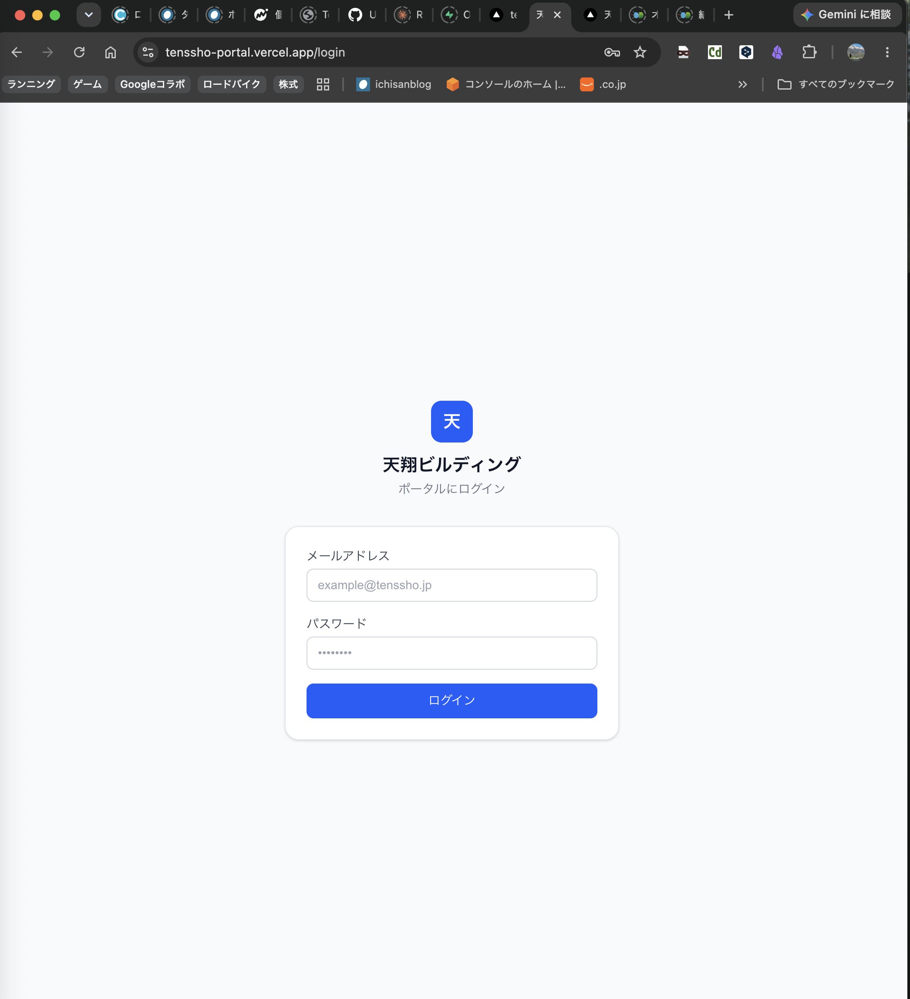
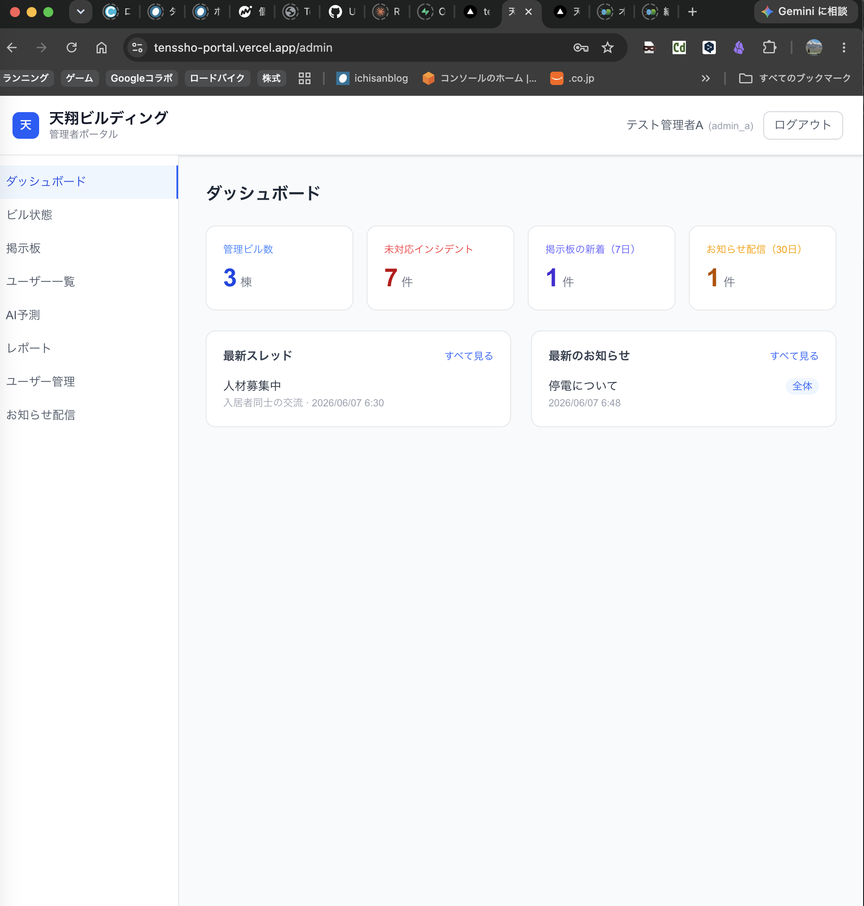
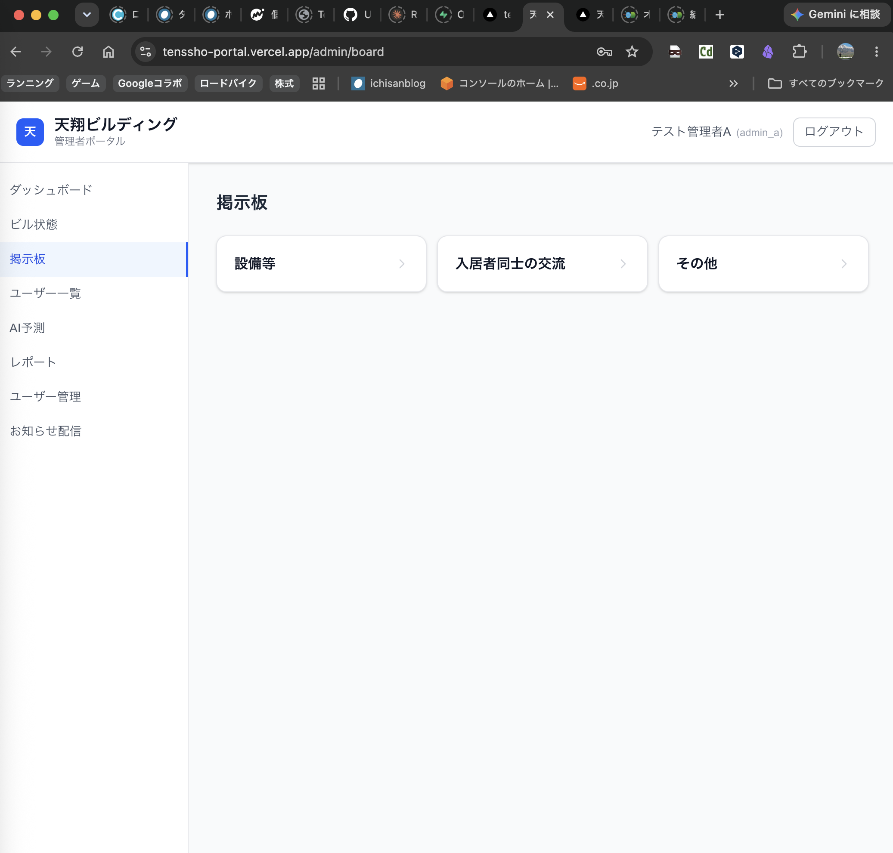

# 天翔ポータル（Tenssho Portal）

ビル管理会社向けの統合管理ポータル。ビル状態管理・AI予測・6ロール認証・入居者掲示板・お知らせ配信を備えた、本番稼働中のWebアプリケーションです。

**本番URL：** https://tenssho-portal.vercel.app/login

> 個人開発・設計から実装・デプロイまで一人で担当

---

## スクリーンショット

| ログイン画面 | 管理者ダッシュボード | 入居者掲示板 |
|---|---|---|
|  |  |  |

---

## デモアカウント

実際に触って確認できます（データは定期的にリセットされます）。

| ロール | メールアドレス | パスワード | 見えるもの |
|--------|--------------|-----------|-----------|
| 管理者A | demo-admin@example.com | （設定後に記載） | 全機能・ユーザー管理 |
| 入居者 | demo-resident@example.com | （設定後に記載） | ビル状態閲覧・掲示板・お知らせ |

---

## 主な機能

### ビル状態管理（フェーズ1〜3）
- 複数ビル（3棟）の設備・清掃・インシデント状態の登録と閲覧
- Claude API によるAI予測（状態履歴からの異常傾向の予測）
- 状態履歴の記録・エクスポート

### 認証・ロール別アクセス制御（フェーズ4-A）
- Supabase Auth による Email/Password 認証
- **6ロール**（管理者A/B/C・清掃員・会長・入居者）による画面分岐
- ログイン後、ロールに応じて `/admin` または `/resident` へ自動リダイレクト
- 未認証・権限外アクセスはミドルウェアでリダイレクト

### 入居者掲示板（フェーズ4-B）
- カテゴリ（設備等 / 入居者交流 / その他）→ スレッド → 返信の3階層
- ロール別に投稿・削除ボタンの表示を制御
- 管理者は他人の投稿のモデレーション（削除）が可能

### お知らせ配信（フェーズ4-D）
- 全体配信と「特定入居者向け」配信の2種類
- 配信可能なロールを権限マトリクスで制御（特定配信は管理者A・会長のみ）
- 入居者は閲覧専用ページで自分宛のお知らせのみ表示

### ユーザー管理（フェーズ4-E）
- 管理者Aのみ操作できるアカウント追加・削除・ロール変更UI
- サーバーサイド（service role）経由で profiles テーブルへ安全にINSERT

---

## 権限マトリクス（抜粋）

○ = 権限あり　— = 権限なし

| 機能 | 管理者A | 管理者B | 管理者C | 清掃員 | 会長 | 入居者 |
|------|:---:|:---:|:---:|:---:|:---:|:---:|
| ビル状態の閲覧 | ○ | ○ | ○ | ○ | ○ | ○ |
| ビル状態の更新 | ○ | ○ | — | ○ | ○ | — |
| AI予測の実行 | ○ | ○ | ○ | — | ○ | — |
| 掲示板：スレッド作成 | ○ | ○ | ○ | ○ | ○ | ○ |
| 掲示板：他人の投稿の削除 | ○ | ○ | — | — | — | — |
| カテゴリの追加・編集 | ○ | — | — | — | — | — |
| アカウント追加・削除・ロール変更 | ○ | — | — | — | — | — |
| お知らせ配信（全体） | ○ | ○ | ○ | ○ | ○ | — |
| お知らせ配信（特定入居者） | ○ | — | — | — | ○ | — |
| 状態履歴のエクスポート | ○ | ○ | — | — | — | — |

完全版は [docs/auth-design.md](docs/) の設計ドキュメントを参照してください。

---

## 設計で工夫した点

### 1. UIの出し分けだけに頼らない多層防御
ボタンの非表示（フロント）だけでなく、**Supabase の Row Level Security（RLS）でデータベース層でも権限を強制**しています。仮にAPIを直接叩かれても、他ロールのデータ操作はDB側で拒否されます。

\`\`\`sql
-- 例：掲示板返信のDELETEポリシー
-- admin_a/b は全件、その他のロールは自分の投稿のみ削除可
CREATE POLICY "board_replies_delete" ON public.board_replies
  FOR DELETE USING (
    (SELECT role FROM public.profiles WHERE id = auth.uid())
      IN ('admin_a', 'admin_b')
    OR user_id = auth.uid()
  );
\`\`\`

### 2. profiles テーブルの INSERT をサービスロール限定に
ユーザー登録はクライアントから直接INSERTさせず、**サーバーサイド（service role キー）経由のみ**に制限。なりすましロールでの自己登録を防いでいます。

### 3. スキーマ変更はマイグレーションファイルで管理
\`supabase db push\` で適用するSQLマイグレーションをリポジトリに残し、DB構成の変更履歴を追跡可能にしています。

---

## 技術スタック

| 役割 | 技術 |
|------|------|
| フロントエンド | Next.js（App Router）/ TypeScript / Tailwind CSS |
| 認証・DB | Supabase（Auth / PostgreSQL / Row Level Security） |
| AI予測 | Claude API |
| デプロイ | Vercel（main ブランチへの push で自動デプロイ） |

---

## データベース設計（概要）

\`\`\`
auth.users（Supabase Auth）
   │ 1:1
public.profiles（id, name, role, room_no）
   │
   ├── board_threads（スレッド）──< board_replies（返信）
   │         │
   │   board_categories（カテゴリ）
   │
   └── notifications（お知らせ：全体 / 特定入居者向け）
\`\`\`

全テーブルで RLS を有効化。ロール判定は
\`(SELECT role FROM public.profiles WHERE id = auth.uid())\` で行っています。

---

## ローカルでの起動方法

\`\`\`bash
git clone https://github.com/systemi3/tenssho-portal.git
cd tenssho-portal
npm install

# .env.local を作成（.env.example を参照）
# NEXT_PUBLIC_SUPABASE_URL=
# NEXT_PUBLIC_SUPABASE_ANON_KEY=
# SUPABASE_SERVICE_ROLE_KEY=
# ANTHROPIC_API_KEY=

npm run dev
\`\`\`

---

## 開発の歩み

| フェーズ | 内容 |
|---------|------|
| 1〜3 | ビル状態管理・AI予測・履歴 |
| 4-A | 6ロール認証・ログイン・画面分岐 |
| 4-B | 入居者掲示板（カテゴリ・スレッド・返信） |
| 4-C | 管理者サイドバー・ロール別メニュー分岐 |
| 4-D | お知らせ通知機能 |
| 4-E | ユーザー管理UI |
| 4-F | ビル状態管理の管理画面統合 |
| 公開 | Vercel 本番デプロイ |
